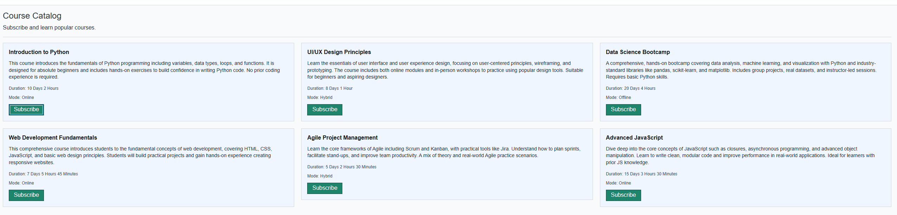
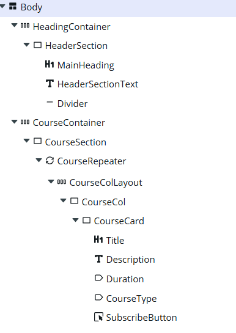
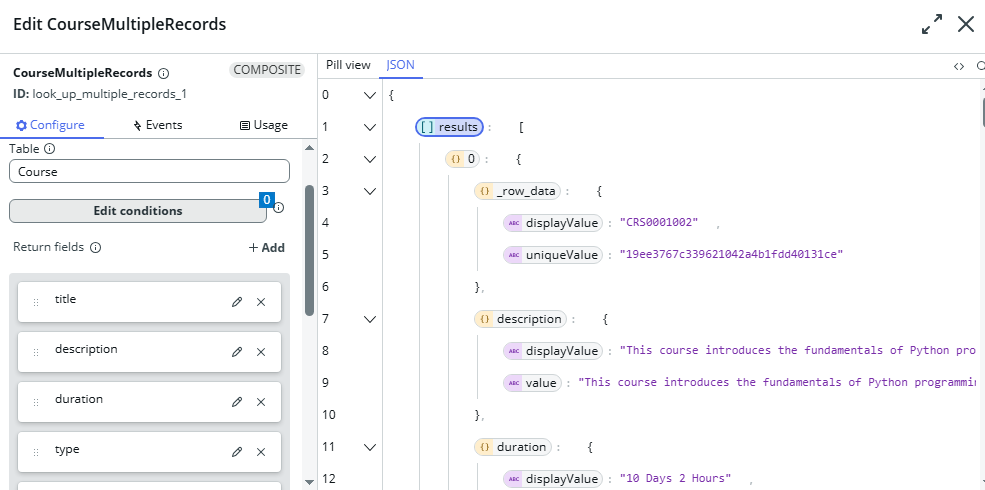

# Course Subscription Application

## Introduction

This project is a prototype of a **Course Subscription Application** developed using the **ServiceNow Platform**. It allows learners to browse available courses in a visually structured layout using UI Builder. The implementation focuses on **PRD01: Course Listing**, which is fully functional. The remaining subscription functionality (PRD02) is not completed, due to platform learning curve and other constraints.

**Repository**: https://github.com/roshanbist/coursehub-servicenow

## Features Implemented

### PRD01: Course List ✅ **COMPLETED**

**Functionality**: Displays a list of available courses with course details and a “Subscribe” button for each course.
Sample data was inserted into the course and learner tables for UI demonstration purposes.

- **Table Used**: `x_quo_coursehub_course`
- **Displayed Fields**: Title, Description, Type (Online/Offline/Hybrid), Duration
- **UI Components**:
  - `now-layout-container` – Page layout
  - `now-repeater` – Dynamically iterate through courses
  - `now-card` – Display each course as a card
  - `now-button` – Display "Subscribe" buttons
  - `now-stylized-text` – Display the Description of course
- **Data Resources**:
  - `Look up multiple records` to fetch all course entries from the course table

## User Interaction – Step-by-Step Explanation

When a user accesses the Course Subscription application, they are presented with a simple and clear interface to explore available courses. Here's how they interact with the key feature implemented in this submission:

1. **Access the Application**  
   The learner logs in to the platform and navigates to the CourseHub experience using a web link (e.g., `/x/quo/qdx-course-hub/home`). This link opens the Course Listing page, which is the main interface built for this assignment.

2. **View the Course List (PRD01)**  
   Upon loading the page, the learner sees a list of courses displayed in a proper format. Each course is shown inside a visual card layout, which includes the following details:

   - **Course Title**: The name of the course is shown as the main heading
   - **Description**: A short summary that describes the course content
   - **Type**: Indicates whether the course is Online, Offline, or Hybrid
   - **Duration**: How long the course takes, shown in a readable format

3. **Interact with Course Cards**  
   Each course card includes a **"Subscribe"** button. Although this button does not yet perform any subscription action, it is designed to guide learners toward subscription.

4. **Next Action (TODO)**  
   Clicking the Subscribe button will open a confirmation window, allow the learner to confirm their subscription, and provide immediate feedback — such as showing a success message and changing the button to "Unsubscribe."

## Unimplemented Parts & Reasoning

### ❌ PRD02: Course Subscription Logic (Not Implemented)

The UI for subscription buttons exists, but the backend logic for creating subscriptions is not yet functional.

**Reasons for Incompletion**:

- Early-stage learning curve with data brokers, state parameters, and action chaining
- Need to go through unfamiliar parts of the ServiceNow data resource framework

**Planned Implementation (Future)**:

- Use "Create Record" data resource on `x_quo_coursehub_course_subscription`
- Bind learner selection via current user reference
- Add client-side condition to prevent duplicate subscriptions
- Show success message on subscription

## Setup and Installation

### Prerequisites

1. ServiceNow Personal Developer Instance (PDI)
2. Git access to repository
3. Basic understanding of ServiceNow UI Builder

### Installation Steps

1. Clone repository: `git clone https://github.com/roshanbist/coursehub-servicenow`
2. Import application into ServiceNow Studio using Git integration
3. Verify tables and data model import
4. Access UI Builder and navigate to CourseHub experience
5. Open Home page to view course listings

## Screenshots Reference

All screenshots are located in the `/screenshots` folder:

- **prd01-01-course-listing.png** : Main course listing page showing all available courses
  

- **prd01-02-component-layout.png** : Component hierarchy in UI Builder for the course list page
  

- **prd01-03-data-resource-courses-record.png** : Data Resource setup for fetching courses from the table
  

## Challenges Encountered

- PDI creation issue from servicenow end
- new to servicenow and go through documentation each time
- Platform-specific element identification
- challenges in implementing custom styling for components
- challenges in understanding the data resources flow and script

## Learning Outcomes

Through this assignment, I gained understanding of:

- ServiceNow UI Builder component architecture
- Data resource configuration and binding
- ServiceNow table relationships and data modeling
- ServiceNow development workflow and Git integration
